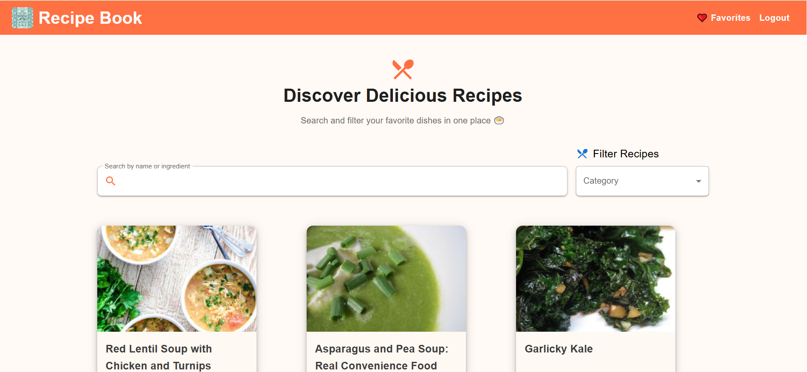
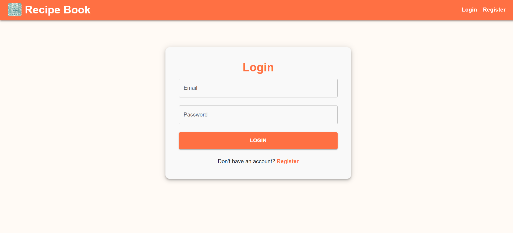
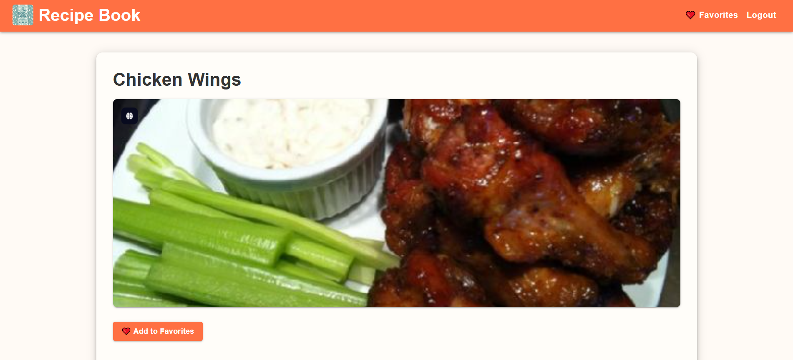

# 🍽️ Recipe Book App

A responsive and modern Recipe Book application built with **React** and **Material UI** featuring:

- 🔐 Manual user authentication (without Firebase)
- 🔍 Recipe search by name or ingredients
- 🏷️ Category and tag filters
- ⭐ Recipe rating and reviews
- ❤️ Favorite saving functionality
- 🚫 Protected routes (only authenticated users can access app)

---

## 🌐 Live Demo

👉 [Live Demo](https://recipe-book98.vercel.app/)

---

## 📸 Screenshots






---

## 🧑‍💻 Getting Started

Follow these steps to clone and run the project on your local machine:

### 1️⃣ Prerequisites

Make sure you have the following installed:

- **Node.js** (v14+)
- **npm** or **yarn**
- Git

### 2️⃣ Clone the Repository

```bash
git clone https://github.com/your-username/Recipe-Book.git
cd recipe-book

3️⃣ Install Dependencies

npm install

4️⃣ Set Up Environment Variables

Create a .env file in the root directory:

touch .env

And add the following:

REACT_APP_API_URL=http://localhost:3000

This can be extended if backend APIs are added.

5️⃣ Run the App

npm start

The app will be available at:
📍 http://localhost:3000


recipe-book/
├── public/
│   └── index.html
├── src/
│   ├── assets/              # Images, Icons, etc.
│   ├── components/          # Navbar, Recipe Cards, ProtectedRoute
│   ├── pages/               # Home, Favorites, Login, Register
│   ├── auth/                # AuthContext and logic
│   ├── App.js
│   ├── index.js
├── .env
├── package.json
└── README.md
